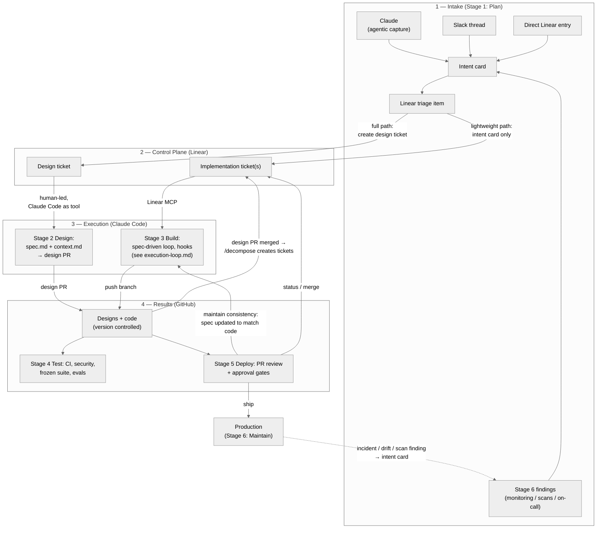

# Spec-Driven Agentic SDLC

This folder documents how work moves from raw inputs to merged, monitored code. The workflow keeps our two-phase backbone per feature — a **design phase** that produces version-controlled artifacts, and a **build phase** that implements against them — and organizes the full lifecycle into the six stages of [Anthropic's AI-Native SDLC Playbook](https://claude.com/blog/the-ai-native-sdlc-playbook): Plan, Design, Build, Test, Deploy, Maintain.

The merge principle: our process supplies the design-to-build pipeline (spec discipline, context boundaries, routing, review gates); the playbook supplies the outer loop (hooks, deploy governance, autonomous maintenance, measurement). Findings from Stage 6 re-enter Stage 1 as intent cards, closing the loop.

## Using this in a project

This repo ships as a Claude Code plugin, not something you clone into each codebase. Two steps bring the workflow into a project:

1. **Install the plugin** (once per machine): `/plugin marketplace add mschabow/agentic-sdlc`, then `/plugin install sdlc-workflow@agentic-sdlc`. This makes `/spec-design`, `/spec`, `/grill-with-docs`, `/decompose`, `/build`, `/sync-docs`, `/verify-context`, `/distill-context`, `/setup-project`, `/audit-design`, `/update-skills`, plus the shared utility skills `/review-fix-loop`, `/worktree-hygiene`, `/env-handoff`, `/delegated-work-audit`, `/linear-implementation-audit` and `/feature-status` available in every Claude Code session on that machine. Full install and update steps: [rollout.md](rollout.md).
2. **Bootstrap the target repo**: open Claude Code in the codebase you want this running against and run `/setup-project`. It scaffolds `AGENTS.md`, creates a `designs/` folder, and walks through wiring up Linear MCP, the Drive connector, branch protection, and agent identities. Full steps: [setup.md](setup.md).

Run a throwaway design ticket through `/spec-design` first to confirm everything's wired up, then start real feature work: `/spec-design` → merged design PR → `/decompose` → `/build` per implementation ticket.

This repo is public, so no GitHub access is needed to install it. To use the plugin in claude.ai and Cowork, add the same marketplace in each account under Customize → Plugins → Add → Add marketplace.

## The six stages

| Stage | What happens | Skills / tools | Artifact produced | Gate | Detail doc |
|---|---|---|---|---|---|
| **1 — Plan** | Idea captured as an intent card; triaged in Linear | Claude capture, Slack promotion, direct entry | `intent.md` (intent card) | Triage: lightweight path or full design | [lightweight-design.md](lightweight-design.md), [ticket-template.md](ticket-template.md) |
| **2 — Design** | Human-led design session produces the implementation contract | `/spec-design` → `/spec`, context pass, `/grill-with-docs`, `/decompose` | `spec.md` + `context.md`, design PR | Design PR: rigorous lead review | [design-loop.md](design-loop.md) |
| **3 — Build** | Orchestrated build against the contract: Sonnet build subagents per ticket in their own worktrees, Opus review per branch, one collector branch; hooks enforce guardrails at edit time | `/build`, `/verify-context`, `/distill-context`, `/sync-docs`, AGENTS.md, hooks | Branch + code diff | Hooks (deterministic, pre-action) | [execution-loop.md](execution-loop.md), [hooks.md](hooks.md) |
| **4 — Test** | Spec-derived tests as frozen floor; agent verifies its own work; review agents run | `/review-agent` (+ functional & standards subagents), CI, evals | Test evidence attached to PR | CI: frozen suite + security scans must pass | [review-policy.md](review-policy.md), [skill-eval-framework.md](skill-eval-framework.md) |
| **5 — Deploy** | Differentiated PR review; approval-gate hooks; per-environment autonomy | PR review, hooks, branch protection, CI/CD | Merged PR, deploy record | Implementation PR + approval gates | [deploy.md](deploy.md), [review-policy.md](review-policy.md), [hooks.md](hooks.md) |
| **6 — Maintain** | Monitoring, scans, and on-call emit intent cards back into triage; incidents become evals | Control bands, scheduled scans, Claude on-call | `intent.md` → triage; new eval per incident | Human triage of every autonomous finding | [maintain-loop.md](maintain-loop.md), [metrics.md](metrics.md) |

Each stage ends by committing a versioned artifact; the next stage begins by reading it. The artifact chain is also the audit trail.

## System view

Work moves through four lanes. Intake is flexible and converges at Linear. Linear gates two sequential phases per feature — design then implementation — both of which produce GitHub artifacts. GitHub status flows back to Linear. Stage 6 closes the loop: production findings become new intake.

## Core principles

1. **Intake is flexible; every path produces an intent card.** Work can originate from Claude, Slack promotion, direct human entry, or an autonomous Stage 6 finding. All paths converge as an intent card attached to a Linear triage item (see [lightweight-design.md](lightweight-design.md) for the card format).
2. **Every feature starts with a design ticket.** The first ticket for any feature produces `spec.md` and `context.md`, committed as a merged PR. No implementation begins until that design PR is merged. Sub-threshold changes take the lightweight path and stop at the intent card.
3. **Design artifacts gate implementation.** Implementation tickets are created via `/decompose` from the approved spec. The spec is the implementation contract.
4. **Context files have clean sources.** `context.md` may reference Google Docs, Linear, and specific code. Never Slack — Slack content is promoted to Drive or Linear first.
5. **GitHub holds the results.** Designs and code live in GitHub; the repo is the source of truth for artifacts, and Linear references it.
6. **Linear is the control plane.** Every piece of work is a ticket; status flows back automatically from GitHub.
7. **Rigorous review happens at the design phase; implementation PR review is differentiated** — cursory for agent PRs built against a reviewed spec, standard for human PRs (see [review-policy.md](review-policy.md)).
8. **Hooks enforce before agents act.** Deterministic guardrails — protected paths, formatting, secrets, approval gates — run as code, not as review-time discipline (see [hooks.md](hooks.md)).
9. **Specs and context files are living artifacts.** If the build deviates, the artifacts are updated to match reality.
10. **Tests derived from the spec are the baseline floor.** The build may add tests but may not silently delete or weaken spec-derived tests.
11. **Every production incident becomes a permanent eval.** A fix without a regression eval is incomplete (see [maintain-loop.md](maintain-loop.md)).
12. **Separation of duties.** Agents have distinct identities, cannot self-approve, and every autonomous finding is triaged by a human (see [agent-governance.md](agent-governance.md)).
13. **The workflow is measured.** Leading indicators catch drift early; lagging indicators confirm outcomes (see [metrics.md](metrics.md)).

## How to read these docs

| Doc | Stage | Audience | Purpose |
|---|---|---|---|
| [README.md](README.md) (this page) | All | Everyone | Six-stage view and document map |
| [lightweight-design.md](lightweight-design.md) | 1 | Developers | Intent card format; fast path for sub-threshold changes |
| [ticket-template.md](ticket-template.md) | 1–2 | Everyone | Required structure for Linear tickets |
| [design-loop.md](design-loop.md) | 2 | Developers | /spec → context pass → /grill-with-docs → spec.md + context.md → PR → /decompose |
| [spec-template.md](spec-template.md) | 2 | Developers | Required SPEC structure (includes draft test list) |
| [context-schema.md](context-schema.md) | 2–3 | Developers | Structure, size limit, and discard rules for context.md |
| [execution-loop.md](execution-loop.md) | 3 | Developers | Two-phase context, tests, build |
| [hooks.md](hooks.md) | 3, 5 | Developers & leads | Deterministic guardrails and approval gates |
| [review-policy.md](review-policy.md) | 2, 5 | Leads & developers | Where rigorous review happens; agent vs. human PR standards |
| [skill-eval-framework.md](skill-eval-framework.md) | 4 | Leads | Skill versioning, evals, incident-to-eval, propagation |
| [deploy.md](deploy.md) | 5 | Leads | CI/CD integration, autonomy tiers, managed settings |
| [maintain-loop.md](maintain-loop.md) | 6 | Leads & developers | Control bands, scans, on-call, incident-to-eval |
| [metrics.md](metrics.md) | All | Leads | Leading and lagging indicators |
| [agent-governance.md](agent-governance.md) | All | Leads | Agent identity, permissions, routing, human override |
| [drive-conventions.md](drive-conventions.md) | All | Everyone | Google Drive structure and naming |
| [setup.md](setup.md) | — | Developers | Bootstrapping a new code repo |
| [rollout.md](rollout.md) | — | Everyone | How this workflow is distributed: process repo + plugin |
| [workflows/](workflows/) | 3–4 | Developers | Agent workflow definitions (review, doc-ops, pipeline) |
| [adr/](adr/) | All | Leads | Decision records and known constraints |
| [open-questions.md](open-questions.md) | — | Leads | Unresolved items |

## Tooling

| Tool | Role |
|---|---|
| Linear + Linear MCP | Control plane; tickets created and pulled by Claude Code |
| Claude Code + sdlc-workflow plugin | Runs the design and build loops via skills and slash commands (see [rollout.md](rollout.md)) |
| /spec-design, /spec, /grill-with-docs, /decompose | Stage 2 skills — see [design-loop.md](design-loop.md) |
| /build, /verify-context, /distill-context, /sync-docs | Stage 3 skills — see [execution-loop.md](execution-loop.md) |
| /review-fix-loop | Review, fix, re-review until no blocker or major findings remain; `/build` uses it on every branch |
| /worktree-hygiene | Report every branch and worktree (unpushed, unmerged, stale) and clean up on request |
| /env-handoff | Write a handoff doc, push it, and post it to Linear; or pick up from one |
| /delegated-work-audit | Asked-versus-delivered table for a teammate's or agent's PRs, with scope-creep check |
| /linear-implementation-audit | Check open Linear tickets against the code and update them one at a time |
| /review-agent (+ functional, standards) | Stage 4 review orchestration — see [workflows/review-agent.md](workflows/review-agent.md) |
| /doc-ops | Documentation freshness audits, read-only — see [workflows/doc-ops-agent.md](workflows/doc-ops-agent.md) |
| /audit-design | Interactive whole-codebase audit: reconciles stale docs, cleans up dangling code, backfills specs for undocumented features. Run on demand, not part of the per-feature loop — see [workflows/doc-ops-agent.md](workflows/doc-ops-agent.md) for how it differs from /doc-ops |
| /setup-project | Bootstraps a new repo; pins skill versions when needed |
| /update-skills | Run after a skill PR merges: refreshes the marketplace, updates the installed plugin, and finds stale duplicate copies (loose `~/.claude` files, claude.ai-synced skills, repo copies) that can shadow it |
| /feature-status | Feature-by-surface build status for a product feature: maps spec stories to tickets and PRs, flags journeys with no surface, lists merge, deploy and pilot gates, and republishes one status page |
| `.claude/commands/` (this repo) | Canonical source for all workflow skills — versioned, eval-gated |
| `.claude/evals/` (this repo) | Eval cases per skill, plus incident-derived evals |
| `.claude/hooks/` (per repo) | Deterministic guardrails and approval gates — see [hooks.md](hooks.md) |
| `ci/validate-context.sh` | CI enforcement of context.md schema, 300-line limit, no-Slack rule |
| Google Drive connector | Feature subfolder + `_evergreen/` during context gathering |
| Context7 / other MCPs | Current library documentation during context gathering |
| GitHub Actions | CI/CD: security scans, frozen test suite, context validation, eval runs |
| AGENTS.md (per repo) | Agent constitution: build commands, conventions, pins, what not to touch |
