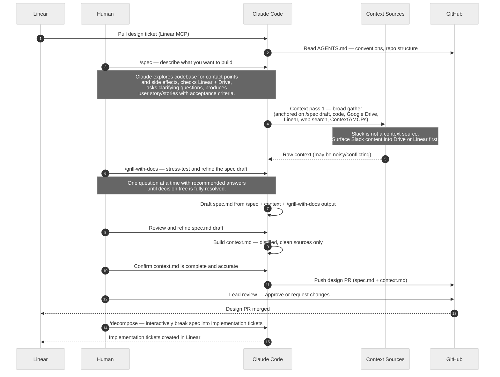
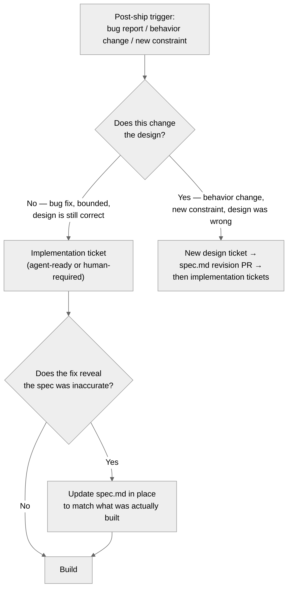

# Design Loop — Claude Code

**Stage 2 of the [six-stage lifecycle](README.md).** Input: a triaged design ticket with its intent card ([lightweight-design.md](lightweight-design.md)). Output: `spec.md` + `context.md` as a merged design PR.

**Trigger: run `/spec-design` in Claude Code.** It orchestrates this entire loop from a single command.

This is the detailed view of the **design phase** in lane 3 of the [system view](README.md). It applies to **design tickets only** — the output is `spec.md` and `context.md` committed to the repo as a merged PR. No implementation tickets are created until this PR is merged.

The design phase is the highest-judgment step in the workflow. **A human engineer owns and drives this phase interactively** — it is not autonomous. Claude Code is a tool the human uses: to run `/grill-with-docs`, to gather context, and to draft `spec.md` and `context.md`. The human reviews every artifact before the PR is pushed. Architecture decisions and approval always belong to a human.

## Sequence

## Step 1 — /spec

Run `/spec` and answer the prompt: "What do you want to build or change?" in a short sentence or paragraph.

`/spec` explores the codebase for contact points and side effects, checks Linear and Drive for related context, asks clarifying questions one at a time, and produces a structured first-draft spec. If the prompt uncovers more than one distinct capability, it surfaces multiple user stories — each will become its own sub-ticket in Linear later via `/decompose`.

**Output of /spec:**
- One or more SCRUM user stories: "As a [role], I want [capability], so that [benefit]"
- Acceptance criteria per story (observable and testable)
- Code contact points: files and interfaces that would change
- Side effects and risks: what else could break, migration concerns
- Out-of-scope items

This draft is the anchor for the context pass that follows.

## Step 2 — Context pass 1

After `/spec`, broad context gathering deepens and validates the draft. Before starting, confirm the feature's Drive subfolder exists and is linked in the Sources field of the design ticket — create it now if not (see [drive-conventions.md](drive-conventions.md)).

Context sources for the design phase:
- Existing codebase (see [ADR-0002](adr/0002-local-repo-clone.md) for local clone requirement)
- Google Drive: the feature subfolder linked in the ticket's Sources field, plus `_evergreen/`
- Linear: ticket history, linked PRDs, prior decisions and comments
- Web search and Context7/MCPs for current library and API documentation

**Slack is not a valid context source.** If relevant information exists only in Slack, summarise it into a transcript in the feature's Drive subfolder before starting Pass 1.

## Step 3 — /grill-with-docs

After the context pass, run `/grill-with-docs` on the `/spec` draft to stress-test and refine it. By this point the broad context has validated or challenged the initial draft — `/grill-with-docs` works through the remaining ambiguities, one question at a time with recommended answers, until all branches of the decision tree are resolved. Along the way it pins contested terminology to `glossary.md` and writes an ADR to `adr/` for any decision that's hard to reverse, surprising, and a genuine tradeoff.

**What /grill-with-docs resolves at this stage:**
- Constraints and trade-offs surfaced by the context pass
- Architectural choices: component boundaries, interface changes, data flow
- Any open questions that would surface as blockers during lead review
- Final acceptance criteria — precise enough to be testable

## Step 4 — spec.md draft

Draft `spec.md` using the [spec template](spec-template.md), informed by all three preceding steps. The design section must be precise enough to serve as an agent's implementation contract — not a sketch, a contract.

Human reviews the draft and refines it. This is the right moment to catch architectural issues, not at the implementation PR.

## Step 5 — context.md

Build `context.md`: a distilled markdown file containing only the specific information the build phase will need, scoped to the spec. Sources must be Google Docs, Linear, or specific code. No Slack references.

`glossary.md` (maintained by `/grill-with-docs`) is a separate artifact — a pure term glossary, not this file. Don't conflate the two or merge them.

`context.md` is not a summary of everything you found — it is a minimal, targeted file. The build phase agent reads only this file plus the repo. Anything not needed for the build does not belong here.

## Step 6 — Design PR

Push `spec.md` and `context.md` as a pull request. The design PR is the lead review gate. See [review-policy.md](review-policy.md) for what reviewers check.

## Step 7 — /decompose (after design PR is merged)

Once the design PR is merged, run `/decompose` interactively with Claude to break the spec's acceptance criteria into implementation tickets.

`/decompose` works through the spec's acceptance criteria and proposes a set of tickets where each ticket is:
- Atomic — scoped to specific files or modules
- Independently testable — its criteria can be verified by CI and a smoke test without other tickets being complete first
- Routed — tagged `agent-ready` or `human-required` based on the ticket template criteria

Any proposed ticket whose acceptance criteria depend on another ticket being complete first is flagged and must be restructured, resequenced, or merged before the breakdown is finalised.

The session ends with a complete ticket list ready to create in Linear, covering every spec acceptance criterion exactly once.

## Post-ship feedback loop

Any post-ship change to an existing feature follows this routing decision before any ticket is created:

**Key rules:**

- `spec.md` is always edited in place — it reflects what the system currently does, not the original plan. Never archive or duplicate it.
- A bug fix with no design implication goes straight to an implementation ticket. No design PR required.
- Any change that affects acceptance criteria, component interfaces, or data flow requires a spec revision PR reviewed by a lead before implementation begins — same threshold as the context staleness rule in [review-policy.md](review-policy.md).
- If a bug fix reveals the spec was already inaccurate (it described something that was never implemented correctly), update `spec.md` as part of the fix PR, not as a separate effort.

**What counts as "changes the design":** same threshold as the staleness rule — acceptance criteria, component interfaces, or data flow. If only the implementation detail changes (a different algorithm, a refactored internal, a library swap), the design is unchanged and no design ticket is needed.

## Invariants

1. `/spec` runs first — before context gathering and before `/grill-with-docs`. It anchors both.
2. `/grill-with-docs` runs after the context pass — not before. The context pass validates and challenges the `/spec` draft; `/grill-with-docs` resolves what remains.
3. Human is present throughout and reviews both `spec.md` and `context.md` before the PR is pushed.
3. `context.md` contains no Slack references; all sources trace to Google Drive, Linear, or code.
4. No implementation tickets are created until the design PR is merged.
5. Implementation tickets are always created via `/decompose` — not written manually — so coverage of spec acceptance criteria is verified.
6. Every spec acceptance criterion is covered by exactly one implementation ticket; no criterion is left unassigned or duplicated across tickets.
7. The spec is precise enough that an agent reading it, `context.md`, and `AGENTS.md` could implement the feature correctly without asking follow-up questions.
