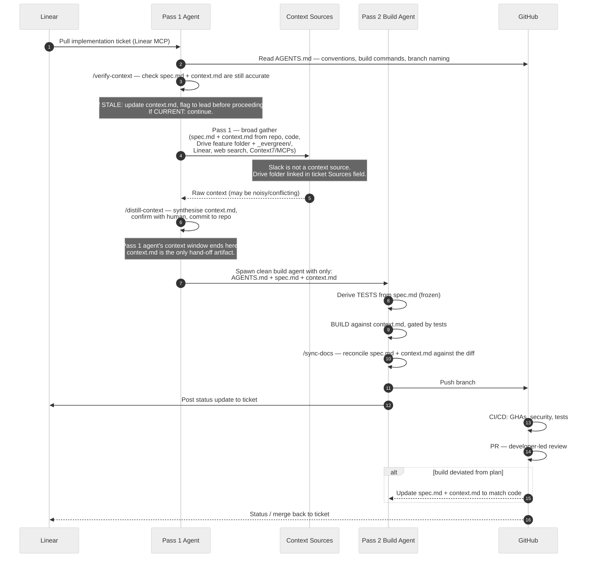
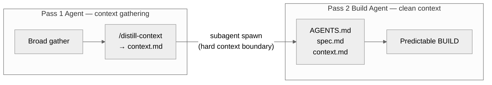

# Execution Loop — Claude Code

**Stage 3 of the [six-stage lifecycle](README.md)** (its test derivation and CI gates are Stage 4). Build-time guardrail hooks ([hooks.md](hooks.md)) are active throughout: protected paths, spec-derived test protection, auto-format, secret blocking.

**Trigger: run `/build` in Claude Code.** It orchestrates this entire loop from a single command.

This is the detailed view of the **build phase** in lane 3 of the [system view](README.md). It applies to **implementation tickets only** — the design ticket (producing `spec.md` and `context.md` as a merged PR) is a prerequisite and is not covered here.

The build phase uses a two-agent architecture. A **Pass 1 agent** gathers broadly and then runs `/distill-context` to produce a minimal `context.md`. A **Pass 2 build agent** is spawned with a clean context window containing only `context.md`, `spec.md`, and `AGENTS.md` — it never sees Pass 1's noisy gather. The context boundary is architecturally enforced, not discipline-dependent.

## Routing check

Before starting, confirm the ticket is tagged `agent-ready`. If it is tagged `human-required`, hand off to the assigned engineer — the rest of this loop does not apply. If it is tagged `competitive multi-agent`, coordinate with the lead to spin up parallel agent runs per [agent-governance.md](agent-governance.md).

## Sequence

## Two-agent architecture

**Pass 1 agent** gathers broadly: the codebase (see [ADR-0002](adr/0002-local-repo-clone.md)), the feature's Drive subfolder and `_evergreen/` (linked in the ticket's Sources field — see [drive-conventions.md](drive-conventions.md)), Linear ticket history, web search, and Context7/MCPs. **Slack is not a valid context source** — if relevant information exists only in Slack, capture it as a transcript in the Drive feature folder first.

`/distill-context` then synthesises that raw material into a minimal `context.md`, confirmed by the human before the Pass 1 agent's session ends. `context.md` is committed to the repo and is the only hand-off artifact.

**Pass 2 build agent** is spawned with a clean context window containing exactly `AGENTS.md`, `spec.md`, and `context.md`. It has no access to Pass 1's gather — the subagent boundary enforces this architecturally. The build agent derives tests from the spec, implements, and pushes the branch.

## Orchestrated runs (`/build` defaults)

`/build` takes one ticket, a list, or a parent ticket with children. The session that runs it is an **orchestrator**: it plans, gathers context, spawns subagents, and merges, but writes no implementation code. Unless the prompt overrides them, these defaults apply:

1. **Sonnet build subagents, in parallel, each in its own worktree** at `.claude/worktrees/<sub-issue-id>-<slug>`. Tickets are grouped into waves by Linear blockers, the user's build order, and file overlap. At most five build subagents run at once.
2. **Opus review on each branch.** A fresh Opus subagent (never the one that wrote the code) runs `/code-review`. Findings go through `/review-fix-loop`; the orchestrator approves fixes itself and stops for the human only on the loop's stop conditions.
3. **One collector branch** `feat/<parent-ticket-id>-<slug>`. Pass 1 and `/distill-context` run once per run and commit to the collector. Implementation PRs target the collector and are merged into it after review and `/sync-docs`. The full test suite runs on the collector after each wave. The orchestrator opens one PR from the collector to the default branch and stops; a human merges it.

A repo opts out of merging into the collector with `build: no-auto-merge` in AGENTS.md. Branch protection is always honoured: if GitHub refuses a merge, the orchestrator reports it and does not work around it.

## Skills available during execution

The Claude Code plugin provides skills and slash commands covering: git, MCPs, palettes, components, templates, testing, basic design context, and the convention that code comments link back to the SPEC. Plugins may be decomposed into smaller, focused plugins.

## Invariants

1. The ticket is `agent-ready` before this loop begins; `human-required` tickets are handed off.
2. `/verify-context` runs before Pass 1. If it returns STALE, context.md is updated and the lead confirms whether spec.md needs a revision PR before implementation proceeds.
3. `/distill-context` runs at the end of Pass 1 to produce context.md. The human confirms context.md before the Pass 1 agent session ends.
4. The Pass 2 build agent is spawned with only `AGENTS.md`, `spec.md`, and `context.md` — never with Pass 1's raw context. The subagent boundary is the discard mechanism.
5. Tests derived from the spec are the baseline floor, not a ceiling. The build may add tests for edge cases uncovered during implementation. Spec-derived tests may be corrected if the logic is wrong — but any correction must be noted in the PR and the spec updated if the expectation itself was wrong. Spec-derived tests may not be silently deleted or weakened to make a failing implementation pass.
6. The build consumes only `context.md` plus the repo — not the raw pass-1 context.
7. `context.md` contains no Slack references; all context traces to Google Drive, Linear, or code.
8. Code comments reference the SPEC they implement.
9. `/sync-docs` runs after the build and before the branch is pushed, reconciling spec.md and context.md against what was actually built.
10. The Pass 2 build agent posts a status update to the Linear ticket when the branch is pushed.
11. The PR description includes the `/verify-context` verdict (CURRENT or STALE + what was updated) and confirms `/sync-docs` ran, so reviewers can see both checks happened.
12. If the build deviates from the plan, the SPEC and `context.md` are updated to match the implemented code (see [review-policy.md](review-policy.md)).
13. The orchestrating session writes no implementation code. Builds, fixes, and rebases happen in build subagents, each in its own worktree, never in the main checkout.
14. The reviewer of a branch is never the subagent that wrote it.
15. Implementation PRs target the collector branch, not the default branch. Only a human merges the collector into the default branch.
