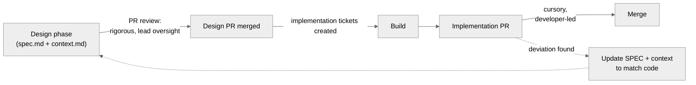

# Review Policy

**Stages 2 and 5 of the [six-stage lifecycle](README.md).** The design PR is the Stage 2 gate; the implementation PR is the Stage 5 gate, backed by the approval-gate hooks in [hooks.md](hooks.md) and the deploy controls in [deploy.md](deploy.md).

Rigorous review is concentrated at the design phase. There are two review gates per feature: the design PR and the implementation PR. The design gate is the high-effort one; the implementation gate is cursory and developer-led.

## Review gates

**Gate 1 — Design PR:** `spec.md` and `context.md` are submitted as a pull request. Leads review for design soundness, scope, testability, and context completeness. No implementation tickets are created until this PR is merged.

**Gate 2 — Implementation PR:** every implementation PR — whether produced by an agent or a human engineer — passes through the same gate. This equality is what keeps agentic contribution safe.

## Responsibilities

| Activity | Owner | Standard |
|---|---|---|
| Design PR review | Leads | Rigorous: design soundness, scope, testability, context completeness, draft test list present, no Slack references in context.md |
| Acceptance criteria check | Design PR reviewer | Criteria in spec match the Linear ticket and are testable before any implementation begins |
| Draft test list check | Design PR reviewer | Each criterion has at least one concrete test case; no criterion is untestable; test cases are reviewed and approved before the build starts |
| context.md schema check | CI (automated) | validate-context.sh passes: required sections present, ≤ 300 lines, no Slack references |
| Implementation PR review (agent) | Developers | Cursory: does the implementation match the spec? Does it pass CI? /verify-context verdict included? |
| Implementation PR review (human) | Developers + lead | Standard review: logic correctness, edge cases, assumptions not in spec, missing error handling — same rigor as any human-authored PR |
| CI gates | Automated (GHAs) | Security scans and the frozen test suite must pass — identical requirement for agent and human PRs |
| Consistency maintenance | Implementing developer | If the build deviated, update the SPEC and context.md to reflect reality |

## What a design PR reviewer checks

1. Problem statement is clear and scoped.
2. Design covers components, interfaces, and data flow with enough precision to be the agent's implementation contract.
3. Diagrams are committed as Mermaid/diagrams-as-code, not binary files.
4. `context.md` references only Google Docs, Linear, and code — no Slack.
5. `context.md` CI validation has passed (validate-context.sh exits 0).
6. Acceptance criteria are explicit, testable, and mirrored in the Linear ticket.
7. **Draft test list is present** — every criterion has at least one concrete test case with input and expected outcome. No criterion is left untestable; if one is, it must be sharpened before approval.
8. Out-of-scope items are explicitly listed.

## What an implementation PR reviewer checks — agent PRs

Agent PRs have been built against a reviewed spec with an approved draft test list. Review is cursory:

1. PR description includes a `/verify-context` verdict (CURRENT, or STALE with update summary) and mechanical diff result.
2. The implementation matches the linked SPEC.
3. Spec-derived tests pass. If tests were added or corrected during the build, the PR description explains why. If a spec-derived test's expectation changed, spec.md has been updated to match. No spec-derived test has been silently deleted or weakened.
4. Code comments link back to the SPEC.
5. General smell tests — nothing surprising relative to the design.

## What an implementation PR reviewer checks — human PRs

Human PRs carry a different risk profile: the implementer may have made assumptions that weren't in the spec, missed edge cases, or introduced logic errors. Standard review applies:

1. All items from the agent PR checklist above.
2. Logic correctness — is the implementation actually correct, not just structurally matching the spec?
3. Edge cases — what inputs or states could break this that the spec didn't anticipate?
4. Error handling — are failure modes handled explicitly or silently swallowed?
5. Assumptions — did the implementer assume something not stated in the spec or context? If so, is the assumption valid?

Human PRs touching security-critical paths require lead review regardless of size.

---

An implementation PR reviewer is explicitly not re-reviewing the design. If the design itself looks wrong, that is a spec problem: raise it against the SPEC, update the artifacts, and keep them consistent with what ships. Specs and context files are living artifacts; preserving inaccurate information is the failure mode this policy exists to prevent.

## Context staleness threshold

When `/verify-context` returns STALE, use this rule to decide whether a new design PR review is required before proceeding:

| What changed | Action |
|---|---|
| Acceptance criteria, component interfaces, or data flow in spec.md | **New design PR required.** Update spec.md, push as a PR, get lead approval before any implementation begins. |
| context.md only — library version, doc reference, resolved ambiguity that does not change what is being built | **No new review.** Developer updates context.md, commits it, and proceeds. Note the update in the PR description. |

When in doubt, default to requiring lead sign-off. The cost of a brief review is lower than the cost of discovering mid-implementation that the spec was wrong.
